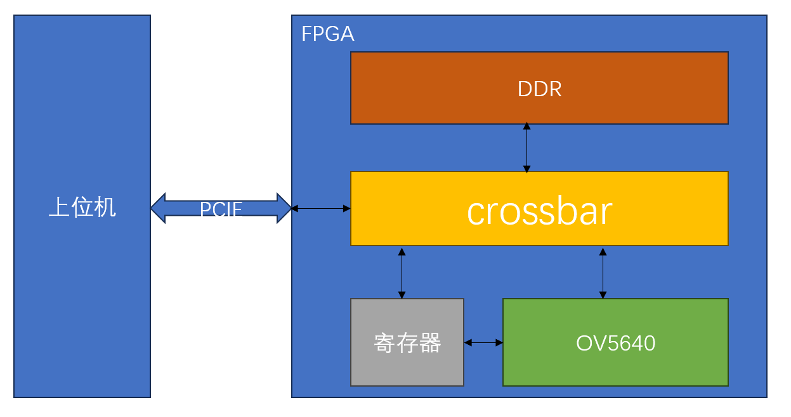

# 基于PCIE和OV5640的摄像头采集设计

## 架构

## 目录

- source/ku5p_ov5640/ov5640_pcie    FPGA代码
- source/pcie_ov5640  上位机代码

## 文档

[基于PCIE和OV5640的摄像头采集设计(一)](https://mp.weixin.qq.com/s/a1ph54uPR-pRJnFuw0Xs4Q)

[基于PCIE和OV5640的摄像头采集设计（二）](https://mp.weixin.qq.com/s/WK9o4a_8PP8aXYn2H7Ds_Q)

[基于PCIE和OV5640的摄像头采集设计(三)](https://mp.weixin.qq.com/s/IaaOxDPPGOsePkGEJHq3mw)

## 视频

[FPGA实现PCIE采集OV5640摄像头视频_哔哩哔哩_bilibili](https://www.bilibili.com/video/BV1vuYizZEVE/)
